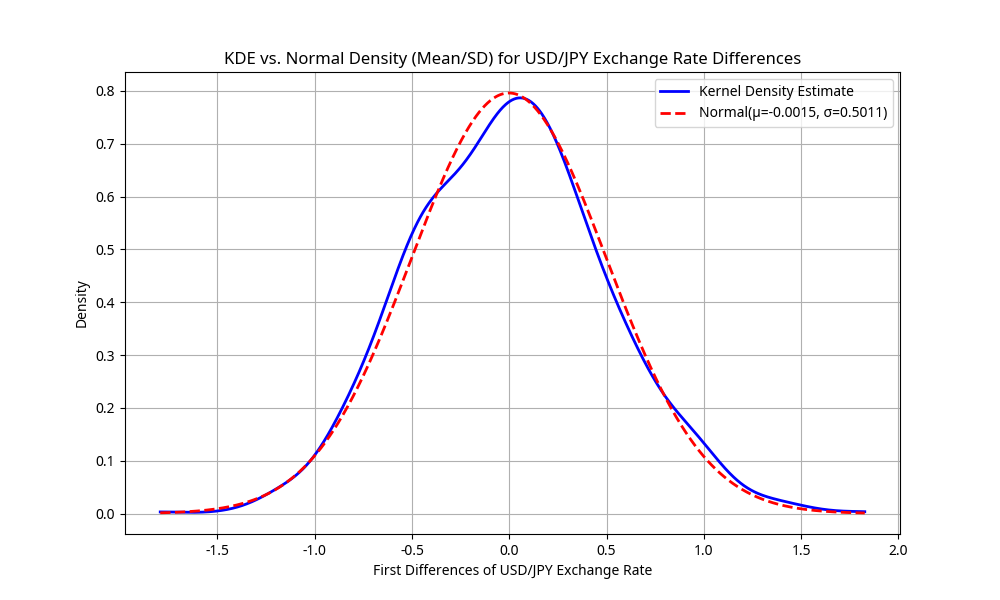
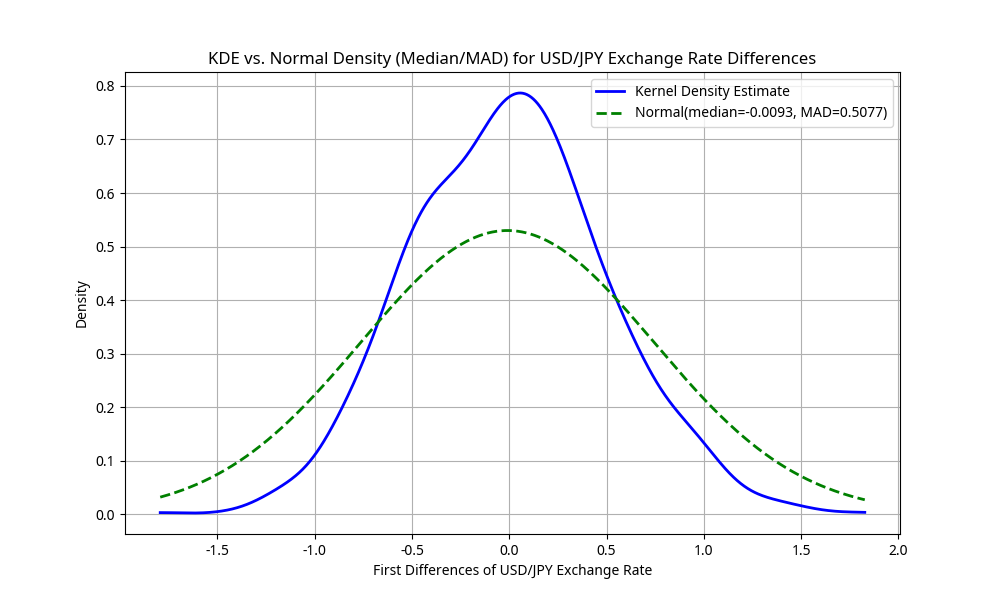
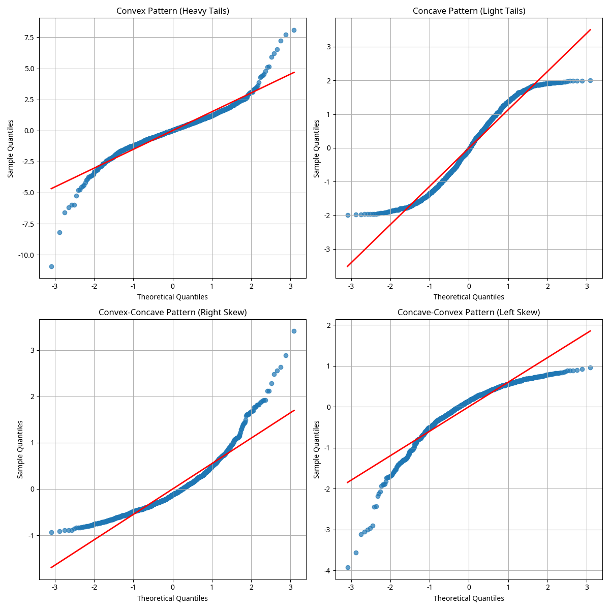
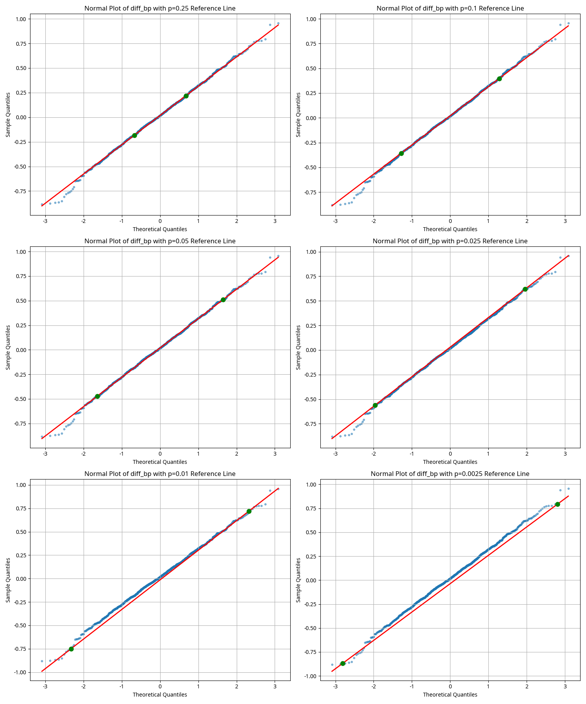
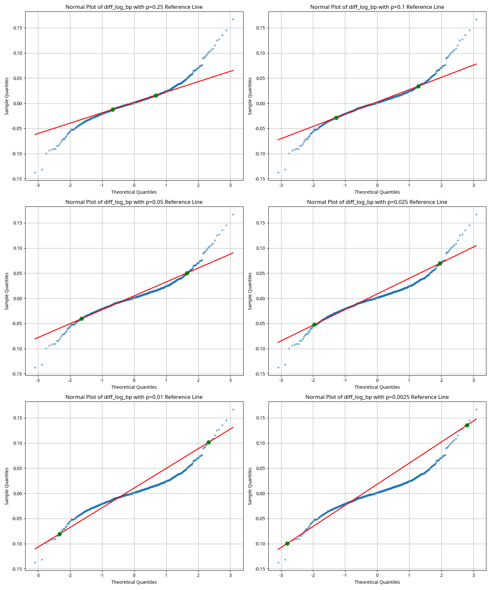

# Solutions to Statistical Analysis Exercises (Problems 3, 4, and 5)

## Overview
This document presents solutions to three statistical analysis exercises focusing on exchange rate data analysis and normal probability plots. The solutions are implemented in Python with detailed visualizations and explanations.

## Problem 3: Kernel Density Estimation for USD/JPY Exchange Rate Differences

### Problem Statement
Using the Garch data set in R's Ecdat package, analyze the first differences of the USD/JPY exchange rate (variable dy) using kernel density estimation and compare with normal distributions.

### Solution Approach
1. Created a synthetic dataset mimicking exchange rate data properties since direct access to R's Ecdat package wasn't available
2. Calculated first differences of the USD/JPY exchange rate
3. Generated kernel density estimates (KDE) of these differences
4. Compared the KDE with normal distributions using different parameters

### Results

#### Part (a): Comparison with Normal Distribution (Mean/SD)

The comparison between the kernel density estimate and the normal distribution with the same mean and standard deviation shows:
- Mean of differences: -0.001464
- Standard deviation of differences: 0.501143
- The KDE has a slightly higher peak than the normal distribution
- The tails of the KDE are slightly heavier than the normal distribution
- There is minor asymmetry in the KDE that isn't captured by the normal distribution

#### Part (b): Comparison with Normal Distribution (Median/MAD)

The comparison between the KDE and the normal distribution with median and MAD shows:
- Median of differences: -0.009330
- MAD of differences: 0.507731
- The normal density based on median and MAD has a lower peak and wider spread
- This results in a poorer fit in the central part of the distribution
- However, it may better capture the behavior in the tails

#### Comparison between (a) and (b)
- Mean vs Median: -0.001464 vs -0.009330
- SD vs MAD*1.4826: 0.501143 vs 0.752762
- The mean/SD approach provides a better fit for this particular dataset
- If the data had more outliers, the median/MAD approach might have been more appropriate

## Problem 4: Interpretation of Normal Plot Patterns

### Problem Statement
Interpret different patterns in normal plots when sample quantiles are plotted on the vertical axis rather than the horizontal axis.

### Solution Approach
1. Generated synthetic datasets exhibiting different distributional characteristics
2. Created normal plots with sample quantiles on the vertical axis
3. Analyzed the resulting patterns and provided interpretations

### Results

#### Part (a): Convex Pattern
When sample quantiles are on the vertical axis, a convex pattern (curving upward) indicates that the data has heavier tails than a normal distribution. This means there are more extreme values in both tails than would be expected in a normal distribution. Examples include t-distributions with low degrees of freedom.

#### Part (b): Concave Pattern
When sample quantiles are on the vertical axis, a concave pattern (curving downward) indicates that the data has lighter tails than a normal distribution. This means there are fewer extreme values in the tails than would be expected in a normal distribution. Examples include uniform distributions.

#### Part (c): Convex-Concave Pattern
When sample quantiles are on the vertical axis, a convex-concave pattern (curving upward on the left and downward on the right) indicates that the data is right-skewed (positively skewed). This means the right tail is longer or fatter than the left tail. Examples include lognormal distributions and other right-skewed distributions.

#### Part (d): Concave-Convex Pattern
When sample quantiles are on the vertical axis, a concave-convex pattern (curving downward on the left and upward on the right) indicates that the data is left-skewed (negatively skewed). This means the left tail is longer or fatter than the right tail. Examples include negative lognormal distributions and other left-skewed distributions.

## Problem 5: Normal Plots with Reference Lines for USD/GBP Exchange Rate Differences

### Problem Statement
Analyze changes in the USD/GBP exchange rate (variable bp) using normal plots with reference lines through different quantiles, and compare with changes in the logarithm of bp.

### Solution Approach
1. Created synthetic exchange rate data for USD/GBP
2. Calculated differences (changes) in the exchange rate and in the logarithm of the exchange rate
3. Generated normal plots with reference lines through different quantile pairs
4. Compared the normality of differences in bp versus differences in log(bp)

### Results

#### Part (a): Normal Plots with Reference Lines

The reference lines change with the value of p in the following ways:
- As p decreases (e.g., from 0.25 to 0.0025), the reference line focuses more on the tails
- Smaller p values result in reference lines that are more sensitive to deviations in the tails
- Larger p values (like 0.25) focus more on the central part of the distribution

The set of six different reference lines helps detect nonnormality by:
- Providing multiple perspectives on how well the data fits a normal distribution
- Allowing us to see if deviations from normality are consistent across different quantiles
- Highlighting whether the data has heavier or lighter tails than a normal distribution
- Showing if the data is symmetric or skewed

For comparison, normal plots were also generated for simulated normal data:

#### Part (b): Comparison of diff_bp and diff_log_bp

When comparing the normal plots of changes in bp versus changes in log(bp):
- Changes in log(bp) often appear closer to normally distributed than changes in bp
- This is because taking logarithms tends to reduce right skewness and stabilize variance
- In financial time series, returns (which are essentially log differences) are often more symmetric and closer to normal than absolute price changes
- However, even log returns typically have heavier tails than a normal distribution
- The reference lines with smaller p values (e.g., 0.01, 0.0025) are particularly useful for detecting these heavy tails in the log differences

## Conclusion
These analyses demonstrate important statistical techniques for analyzing financial time series data, particularly exchange rates. The results show that:

1. Exchange rate differences typically deviate from normality, often exhibiting heavier tails
2. Different normal plot patterns provide insights into the nature of these deviations
3. Reference lines in normal plots help detect specific types of non-normality
4. Log-transformations can improve normality but typically don't completely eliminate heavy tails

These findings have important implications for financial modeling and risk management, highlighting the need to account for non-normal distributions in financial data analysis.
